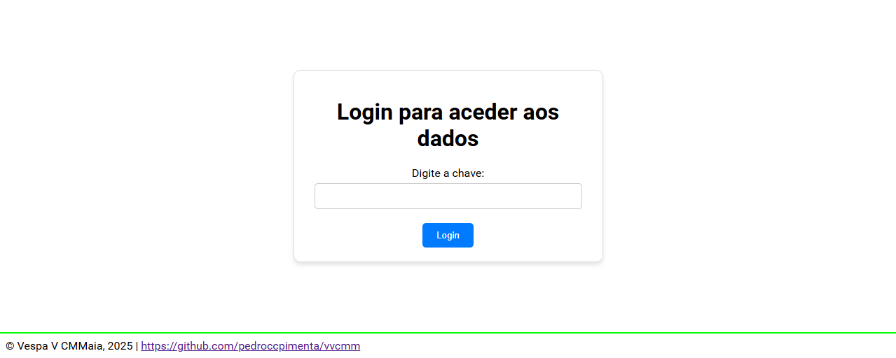
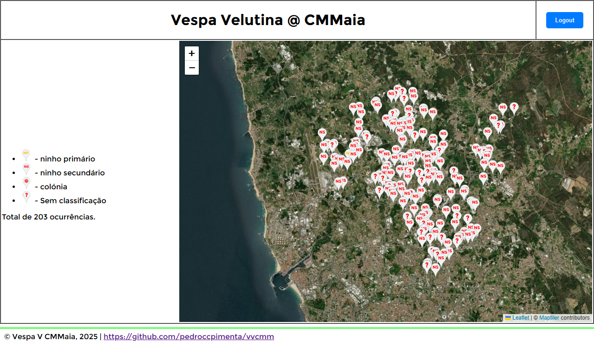
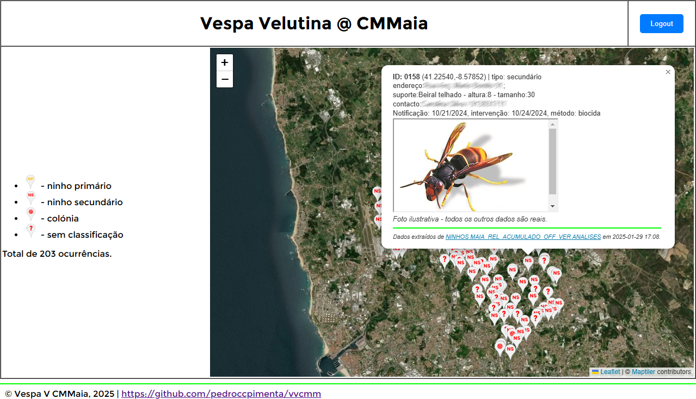

# VespaVM

## Purpose
To set up a private system where 'users' can edit (add, delete, change) geolocated data - name, location (Latitude, Longitude), add a photo (and eventually other properties) of geolocated items/ocurrences and get a 'clickable map' of these items/ocurrencies.

## Objectives
Make the 'users' as autonomous as possible in managing and exploring the data.

## Implementation
Data is edited in a google sheet - [NINHOS MAIA_REL_ACUMULADO_OFF_VER ANALISES googlesheet](https://docs.google.com/spreadsheets/d/1g70Tsb-nQpxrZCuCoTz-fnM01IA8u6x_cVuRx7h7e5k/edit?gid=615971746#gid=615971746). 'Users' can share editing responsabilities.

The code for a flask application is maintained in this repository [Vespa Velutina @ github](https://github.com/pedroccpimenta/vvcmm), and deployed through [render](render.com) at [https://vvcmm.onrender.com/](https://vvcmm.onrender.com/)

## Screenshots

PP, January 2025